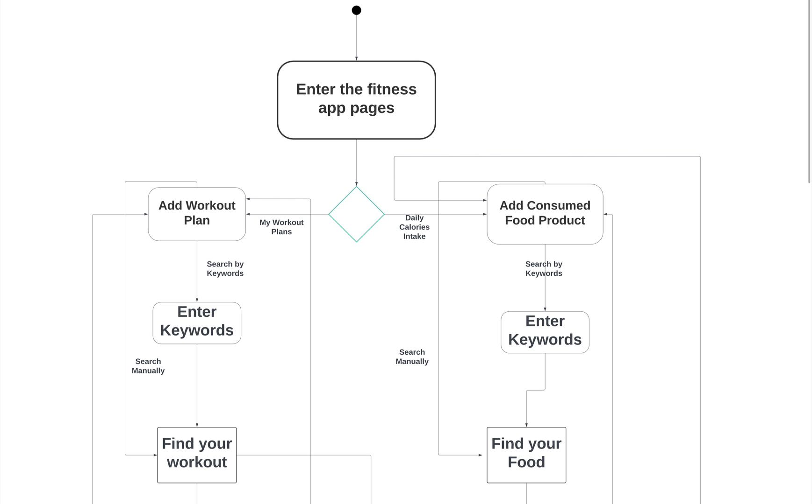
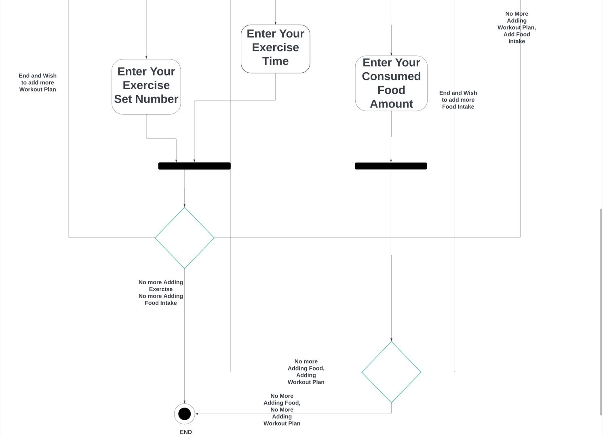

# Specification Phase Exercise

A little exercise to get started with the specification phase of the software development lifecycle. See the [instructions](instructions.md) for more detail.

## Team members

- [Ryoma Nagano](https://github.com/RYOMA-NAGANO)
- [Xueying (Andrea) Tang](https://github.com/AndreaTang123)
- [Yuhao Sheng](https://github.com/imyhalex)
- [Qiyuan (Bryce) Yin](https://github.com/Bryccce)

## Stakeholders

> Dai Xuanming-professional fitness coach in LA Fitness

### Interview from Stakeholder (Q & A)

**_Q: Do you usually use fitness apps to assist with your workouts?_**

> Occasionally, but I mostly follow videos for learning.

**_Q: Why don't you use fitness apps?_**

> Well, I need to think about this. I believe that most fitness apps are overly complicated. Fitness tutorial videos can be more efficient for me.

**_Q: Can you elaborate on how the current fitness apps are complicated?_**

> There are too many fitness plan packages, with cardio, yoga, and strength training mixed together, making it difficult for me to know how to start based on my current situation. Also, the app pages are cluttered with content, making me feel like I need to prepare and learn a lot. It gives me the subconscious impression that fitness is a difficult task and diminishes my interest. Moreover, the app doesn’t link videos with training plans, so I don’t know what to practice next.

**_Q: So how do you think fitness apps should be?_**

> I believe a fitness app doesn't need to have more content to be better. I prefer a simple interface and training plans that align with the target user's needs.

**_Q: There are many types of fitness enthusiasts with different needs. Do you have any suggestions for simplification?_**

> I think designing a fitness app requires a clear target audience rather than trying to cover all aspects of fitness. For example, it can be tailored to people who focus solely on strength training or only provide yoga-related training materials.

**_Q: If we focus solely on one type of fitness, won't it result in a smaller user base for the app?_**

> The app is not limited by region. No matter what type of fitness activity, the market is vast on a global scale. A good fitness app should be more about specialization rather than diversification.

**_Q: What do you think is the problem with the fitness plans provided by current fitness apps?_**

> Current fitness apps usually only offer formulaic fitness plans without fully considering individual differences, such as the user's fitness level, physical condition, and goals. Different people have different physical conditions and goals. A lack of personalized plans can lead to poor results and even increase the risk of injury.

### Summary

**Goals & Needs:**

- She needs a straightforward starting point based on her current fitness level and goals, without being overwhelmed by a variety of options.
- She prefers a clean interface that makes it easy to understand what to do next, rather than a complicated UI design.
- She needs personalized fitness plans that consider individual fitness levels, body, and personal goals.
- She wants access to video demonstrations of exercises to ensure he can perform movements correctly and safely.

**Problems/Frustrations:**

- The abundance of content on app pages can make fitness seem complex and daunting, potentially discouraging her from getting started.
- Existing apps provide formulaic fitness plans that do not account for individual differences. The formulaic fitness plan can lead to ineffective workouts or even injury.
- She will get overwhelmed by frequent in-app notifications and advertisements, which distract from her focus on fitness and create a less enjoyable user experience.
- She often struggles with unclear instructions or explanations for exercises, leaving her unsure of how to perform certain movements properly or effectively.

## Product Vision Statement

The vision behind our application is simple: to simplify the journey towards personal health and fitness. So our vision statement can be:

> Our app empowers users to achieve their fitness goals by providing a comprehensive platform that not only guides through tailored workout plans but also meticulously tracks dietary calorie intake, making healthy living accessible and manageable.

## User Requirements

- As a `fitness beginner`, I need some guidelines on how to use gym equipment and perform exercises correctly, so that I can work out more safely and effectively.

- As `someone new to fitness`, I need motivational reminders and a straightforward progress tracker, so that I can stay encouraged and see tangible results from my efforts.

- As a `professional bodybuilder`, I need the ability to create and customize advanced workout routines that align with my competition preparation cycles, including specific exercises for strength, hypertrophy, and endurance.

- As a `vegetarian`, I need meal plans and nutritional guidance that cater to a plant-based diet, so that I can meet my fitness goals without compromising my dietary choices.

- As a `individual who focus on health`, I need detailed macro and micronutrient tracking, so that I can fine-tune my diet to meet specific health and fitness objectives.

- As a `user with heavy schedule`, I want personalized workout plans of varying lengths so that I can fit exercise into my day, regardless of my time constraints.

- As a `user recovering from an injury from the exercise`, I want customizable low-impact exercises so that I can safely regain my strength without having further injury to myself.

- As a `user focus on diet`, I want to know specific diet component for each meal (what percent of protien, fat, carbonhydate etc)

- As a `parent`, I need family-friendly meal suggestions and quick workouts, so that I can stay healthy while managing my family responsibilities.

- As a `user with limited gym access`, I need workout plans that can be done at home with minimal equipment, so that I can stay fit without needing a gym membership.

## Activity Diagrams

> This UML Diagram fulfills the User Requirement: - As a `user focus on diet`, I want to know specific diet component for each meal (what percent of protien, fat, carbonhydate etc)

> This UML Diagram fulfills the User Requirement: - As a `user with heavy schedule`, I want personalized workout plans of varying lengths so that I can fit exercise into my day, regardless of my time constraints.

> This UML Diagram fulfills the User Requirement: - As a `user with limited gym access`, I need workout plans that can be done at home with minimal equipment, so that I can stay fit without needing a gym membership.

## Wireframe Diagram
- [Here is the link to the wireframe](https://www.figma.com/design/fJZAlrxWfIxjrc75b91auU/garage-group-project-01-(Copy)?t=Um1k2OHaqYFDMIGX-1)

### Update Wireframe (Detailed logic in our product)
- [Here is the link to the newer version, which contains detailed ideas of our product perspective and how each components work](https://www.figma.com/design/UrXb8BgK272Jw8eC97xC8s/garage-group-project-01?node-id=0-1&node-type=canvas&t=Ypx1CztK5JgRvBba-0)

## Clickable Prototype
- [Here is the link to the protptype](https://www.figma.com/proto/UrXb8BgK272Jw8eC97xC8s/garage-group-project-01?node-id=2-58&node-type=canvas&t=OPsCFn5h2IsVRtjV-0&scaling=scale-down&content-scaling=fixed&page-id=0%3A1&starting-point-node-id=2%3A58) 

### Update Prototye (Detailed logic in our product)
- [This is a newer version](https://www.figma.com/proto/UrXb8BgK272Jw8eC97xC8s/garage-group-project-01?node-id=2-58&node-type=canvas&t=Ypx1CztK5JgRvBba-0&scaling=scale-down&content-scaling=fixed&page-id=0%3A1&starting-point-node-id=2%3A58)